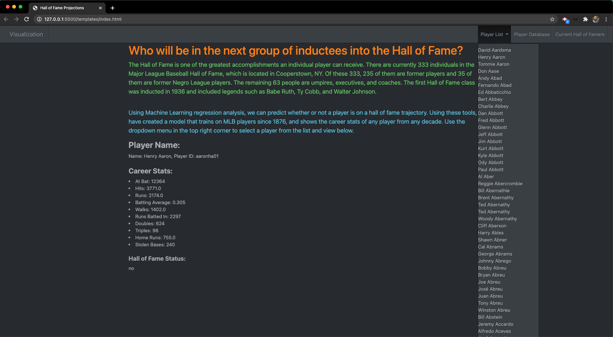
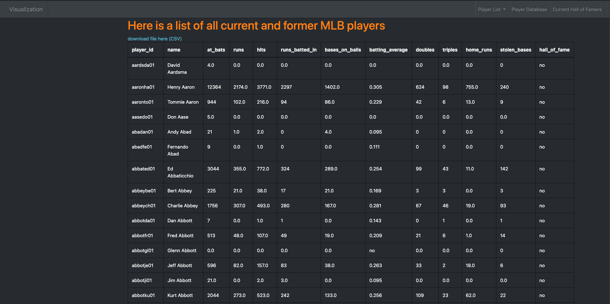

# sportsReference_ML

In this project, I will pull in data from the Major League Baseball using the sports-reference API and upload as a Data Frame using Pandas.
Then I merge Data Frames with a Data Frame of all Hall of Fame players.

Using this data, I will look at the career statistics from every player that has ever played in the league, and use this data to predict whether or not a player deserves to be in the Hall of Fame.

I create a Neural Network to do my Machine Learning classification analysis.

Lastly, the model is then measured using accuracy and precision and is deployed to a static Github page with the aid of JavaScript and HTML.

